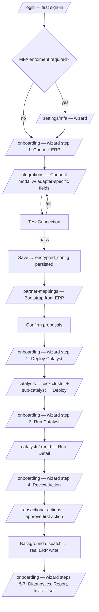
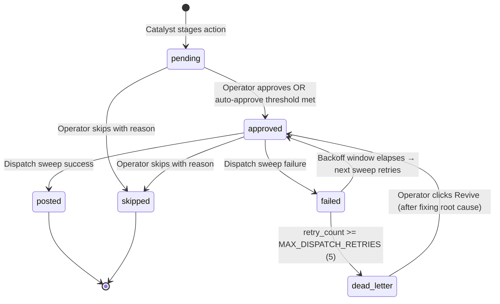
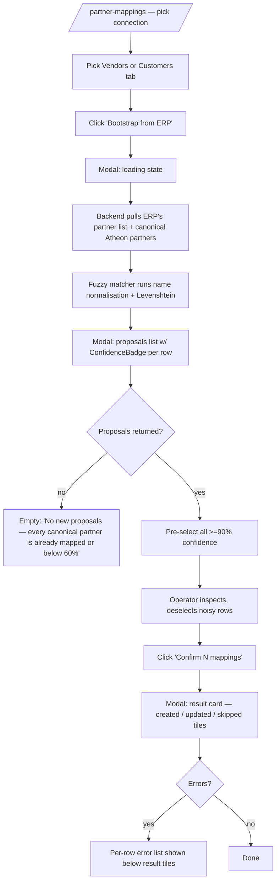
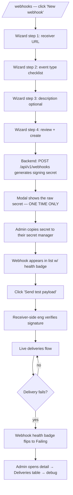
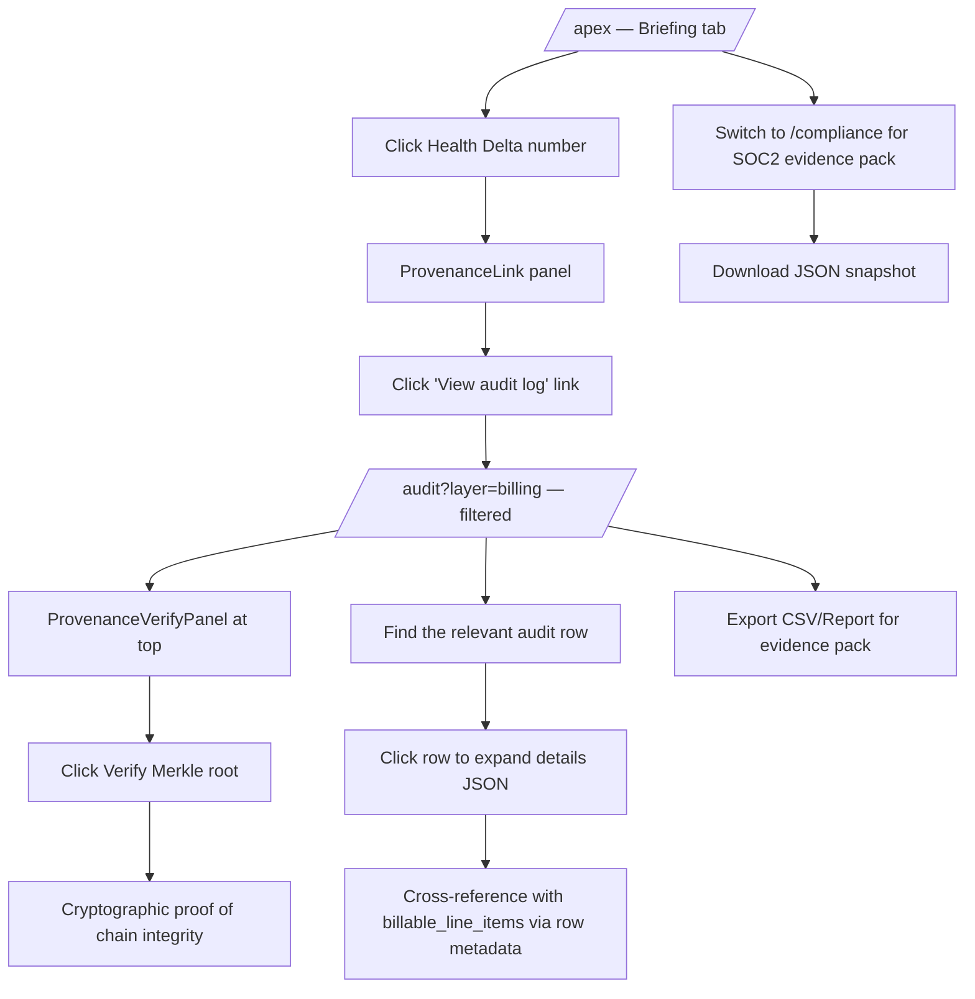
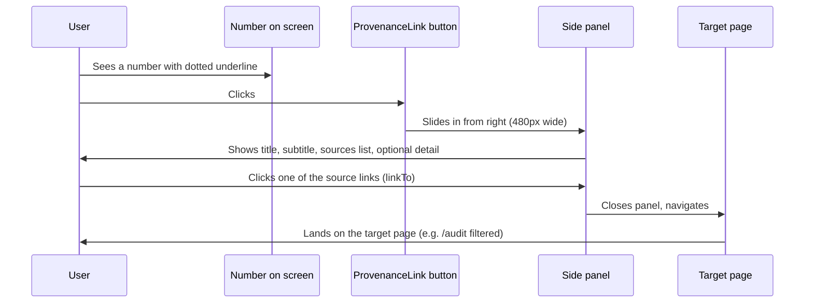
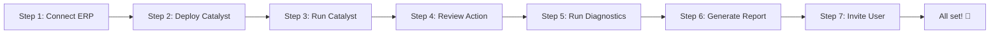

# Atheon — Frontend Design Brief

**Format:** Optimised for import into Stitch (or any design-generation tool). Each section is concrete, declarative, and laid out so a designer or AI tool can produce mockups screen-by-screen.

**Companion doc:** [UX_AUDIT_AND_CONSOLIDATION_PLAN.md](UX_AUDIT_AND_CONSOLIDATION_PLAN.md) for the rationale behind the consolidations recommended here.

---

## 1. Platform intent

**Atheon** is an enterprise intelligence platform that drives **measurable, billable shared savings** by automating the day-to-day operations of finance and supply-chain processes (Accounts Payable, Accounts Receivable, General Ledger, inventory, payroll, treasury) across the customer's existing ERP systems (SAP, Oracle, NetSuite, Xero, Odoo, Sage, Dynamics, etc.).

It does this in three layers:

1. **Insights.** Continuously analyses ERP data + correlated signals (market, regulatory, peer benchmarks, anomalies) to identify what's broken in the customer's processes — risks, exception queues, savings opportunities, KPI drifts.
2. **Action.** A library of **autonomous "catalyst" workflows** (3-way invoice match, dunning runs, cash application, GL bank reconciliation, etc.) that execute the right thing, with human-in-the-loop gating for high-value or low-confidence actions.
3. **Audit-grade traceability.** Every claimed dollar of savings traces back to specific ERP records, the field-mapping that interpreted them, and a confidence score — so every shared-savings invoice is defensible to the customer's CFO and external auditor.

### Two non-negotiable principles (must show up in every screen)

1. **Provenance is a first-class UI primitive.** Every monetary number, every count of records processed, every KPI must be clickable and lead to its underlying ERP records, mapping rule, catalyst run, and confidence score. Without provenance, the shared-savings invoice is uncollectable.

2. **Strong inference, never silent auto-apply.** When the platform infers a rule (3-way match tolerance, dunning days, fiscal year start, vendor mapping), it either applies confidently (sample size ≥25, mode share ≥70%) or surfaces in a Human-In-The-Loop queue and asks the customer. Every UI showing an inferred value displays its confidence tier (High / Medium / Low) and offers a confirm/reject path.

### The three questions every screen must answer at least one of

| Question | Where it gets answered | Primary persona |
|---|---|---|
| What did Atheon save us this period, and how do we prove it? | Apex / ROI / Compliance | Executive |
| What's broken in our processes, and what's being done about it? | Pulse / Catalysts / Action Layer / Findings | Manager + Operator |
| Is the platform itself working — and if not, who's fixing it? | Integration Health / Audit / Support | IT Admin + VantaX staff |

If a screen doesn't answer one of these, it shouldn't exist.

---

## 2. Brand + visual language

### Palette

Dark theme is the default; light theme is available but most users live in dark.

**Dark theme:**
- Background primary: `#06090d` → `#0e151c` (subtle radial gradient)
- Card surface: `var(--bg-card-solid)` — neutral charcoal, slight elevation
- Border: thin (`1px`), low contrast (`var(--border-card)`)
- Text primary: warm off-white
- Text muted: ~50% off-white
- **Accent (sage green):** primary brand colour, used for active states, CTAs, links, "good" status
- Tertiary accents: bronze (warmth), sky (informational)

**Status tones (semantic):**
- Success: emerald-400/500
- Warning: amber-400/500
- Danger: red-400/500
- Info: sky/accent
- Outline: muted, neutral border

### Typography

- Sans-serif system stack (default platform sans, no custom font load)
- Headings 18–28px / semibold
- Body 13–14px / regular
- Captions 10–12px / medium uppercase tracking-wide for labels
- Monospace for IDs, hashes, code, ERP record refs, $-figures with `<ProvenanceLink>` underline

### Visual idiom

- **Glass cards** with subtle blur on dark backgrounds, soft shadow-glow on hover
- **Rounded** — 8px (small), 12px (cards), 16–20px (modals)
- **Sticky context surfaces** — page sub-navs, tenant-context banners, sidebars
- **Generous whitespace** between cards (24–32px)
- Micro-animations only: `animate-fadeIn` on page mount, hover lift on cards, spin on Loader2

### Tone of voice

- Confident, terse, defensible
- Never use "AI" as a buzzword in UI copy. Say what it does ("Inferred from 48 invoices", "Recommended catalyst").
- Money figures are never approximated; show precision and provide drill-through.
- Errors say what to do next ("Add more vendor records before relying on this mapping"), not what failed.

---

## 3. Personas

Seven roles. Each has a "I'm successful when…" statement, core JTBD, top 3 actions, and the anti-pattern (what they should NOT have to do).

### 3.1 Executive — `executive` role

> **CFO / CEO / COO.** I'm successful when I can answer the board's "is this paying for itself?" question in under 30 seconds, with numbers I trust enough to repeat in the next earnings call.

- **JTBD:** monitor financial impact of Atheon, spot emerging risks before they become losses, sign off on board-level reports.
- **Top actions:** scan health + savings delta on landing → drill into a specific risk → export a board-ready brief.
- **Anti-pattern:** being given three different "executive" pages to choose from.
- **Lands at:** `/apex` (auto-routed post-login).

### 3.2 Manager — `manager` role

> **Head of AP / AR / Controller / Operations Director.** I'm successful when my team's exception queue is shrinking week-over-week, my SLAs are green, and I can show my CFO the per-process savings at our next 1:1.

- **JTBD:** triage what's broken in processes I own, assign exceptions, track per-process savings.
- **Top actions:** open Pulse → spot red metric → click through to the catalyst that owns it → review my team's exception queue → reassign.
- **Anti-pattern:** assembling metrics from 3 pages because no single one shows "AP this week".
- **Lands at:** `/pulse`.

### 3.3 Operator — `operator` role

> **AP clerk / AR clerk / GL accountant.** I'm successful when my morning queue is short, every action has clear next steps, and I haven't been blamed for an auto-posted error.

- **JTBD:** work the day's exception queue. Approve, reject, or correct what the catalyst couldn't auto-resolve.
- **Top actions:** open the action queue filtered to "needs my attention" → approve / skip / revive an action → understand why an action failed.
- **Anti-pattern:** queue split across two distinct pages.
- **Lands at:** `/catalysts` (Action Layer).

### 3.4 Analyst — `analyst` role

> **Financial analyst / Process analyst / Internal audit.** I'm successful when I can drill from any number on any chart to the journal entry that created it, and walk an auditor through the chain.

- **JTBD:** investigate metric, validate finding, build audit story.
- **Top actions:** drill from any chart to underlying records → ask Mind a natural-language question → export an audit-defensible PDF.
- **Anti-pattern:** charts that show numbers without click-through.
- **Lands at:** `/mind`.

### 3.5 IT Admin — `admin` role

> **CIO / Head of IT / Application owner.** I'm successful when ERP connections are healthy, partner mappings are populated, users are provisioned, and I haven't been paged this week.

- **JTBD:** operate the platform on behalf of the customer's org. Configure connections, manage users + roles, monitor integration health, respond to alerts.
- **Top actions:** add or rotate an ERP connection → provision/revoke a user with the right role → investigate why a connection is failing.
- **Anti-pattern:** ERP connection management split across 4 pages.
- **Lands at:** `/integrations` (with sticky sub-nav covering Connections / Sync Health / Mappings / Webhooks).

### 3.6 VantaX Support — `support_admin` role

> **VantaX customer success / support engineer.** I'm successful when I can land on a tenant's dashboard, diagnose the issue, and respond to the support ticket — all in under 5 minutes, all without breaking tenant isolation.

- **JTBD:** open a customer's ticket, understand their state, fix or escalate.
- **Top actions:** search for a tenant → impersonate / set tenant context → reply to or triage their ticket.
- **Anti-pattern:** four-page bounce per ticket.
- **Lands at:** `/support` (Support Console).

### 3.7 VantaX Superadmin — `superadmin` role

> **VantaX engineering / platform ops.** I'm successful when the platform is healthy, customers are onboarded smoothly, and I can ship safely without breaking anyone.

- **JTBD:** operate the platform. Tenant CRUD, deployment lifecycle, feature flags, billing, infrastructure ops.
- **Top actions:** investigate a platform-wide alert → roll out a feature flag with a percentage canary → review tenant adoption + revenue.
- **Anti-pattern:** infrastructure pages spread across 5 unrelated URLs.
- **Lands at:** `/support` (the Support Console is the daily entry point; Platform Health / Tenants / Revenue / Feature Flags accessible via the admin-tooling sidebar section).

---

## 4. Cross-cutting design principles

These four primitives appear on most or all screens. They're shared components.

### 4.1 `<ProvenanceLink>`

Wraps any clickable number to expose its source records, mapping, and confidence. Renders the wrapped value as an inline button with a dotted underline. Click slides a panel in from the right edge with:

- **Title** + optional subtitle
- **Sources** list — each row is `label · value · optional internal link · optional tone badge`
- **Detail** — optional rich content block (table, paragraph, code)
- **Footer** — link to `/audit` for the full chain

Example use: `<ProvenanceLink title="Total realised savings" sources={[…]}>$1.2M</ProvenanceLink>`.

### 4.2 `<ConfidenceBadge>`

A small badge tagging an inferred value with its tier. Tooltip surfaces the tier word + percentage + sample size + guidance.

| Tier | Threshold | Tone |
|---|---|---|
| **High** | n ≥ 25 AND confidence ≥ 0.70 | success / green |
| **Medium** | n ≥ 25 AND 0.50 ≤ confidence < 0.70 | warning / amber |
| **Low** | n < 25 OR confidence < 0.50 | danger / red |

Without a sample size, a stricter floor applies (high rises to ≥0.85). Low-tier rules MUST surface in HITL — never auto-apply.

### 4.3 `<TenantContextBanner>`

Sticky orange banner shown to internal staff (`superadmin` / `support_admin`) whenever they have a tenant override active that differs from their own tenant. Carries the tenant name and a one-click Clear button. Sits above the breadcrumbs on every authenticated page.

### 4.4 Sub-nav strips

`<IntegrationsTabBar>` and `<GovernanceTabBar>` render at the top of every page in their respective domains so the user navigates a workspace, not a list of unrelated routes.

| Strip | Tabs |
|---|---|
| **Integrations** | Connections · Sync Health · Live Connectivity · Partner Mappings · Webhooks |
| **Governance** | Audit Log · Compliance · Data Governance |

Active tab uses accent border + accent-subtle background; inactive tabs are neutral text + thin border.

---

## 5. Information architecture

### Sidebar structure

Five collapsible sections in the left rail, role-gated:

```
Intelligence
├─ Dashboard                   (all roles)
├─ Apex                        (executive+; "Executive Intelligence")
├─ Pulse                       (manager+; "Process Intelligence")
├─ Catalysts                   (operator+; "Autonomous Execution")
├─ Chat                        (all roles; "Conversational AI")
├─ Mind                        (admin+; "AI Configuration")
├─ Trust                       (all roles; "Calibration · Provenance · Peers")
└─ Exec Briefing               (executive+; one-page summary)

Data
└─ Memory                      (manager+; "Knowledge Graph")

Administration
├─ IAM                         (admin+; "Users & Roles")
├─ Clients                     (superadmin only; "Tenant Management")
├─ Integrations                (admin+; "Systems & Data Schema")
├─ Partner Mappings            (admin+; "ERP ID Reconciliation")
├─ Action Layer                (admin+; "AP/AR/GL Dispatch Queue")
├─ Webhooks                    (admin+; "Event Subscriptions")
├─ Audit                       (admin+; "Governance")
├─ Compliance                  (admin+; "SOC 2 evidence pack")
└─ Support                     (all roles; "File & track tickets")

Platform Ops
├─ Control Plane               (admin+; "Agent Management")
├─ Deployments                 (superadmin only; "Hybrid & On-Premise")
├─ Assessments                 (superadmin only; "Pre-Sale Analysis")
└─ Connectivity                (admin+; "Protocols")

Admin Tooling
├─ Platform Health             (superadmin only)
├─ Support Console             (support+; "Tenant Support")
├─ Company Health              (admin+; "Org Utilization")
├─ Impersonate                 (support+; "View as User")
├─ Bulk Users                  (admin+; "Import & Manage")
├─ Custom Roles                (admin+; "Role Builder")
├─ Revenue                     (superadmin only; "MRR & Usage")
├─ Feature Flags               (superadmin only)
├─ Data Governance             (admin+; "Retention & DSAR")
├─ Integration Health          (admin+; "Sync Monitoring")
├─ System Alerts               (admin+; "Alert Rules")
└─ Support Triage              (admin+; "Tenant Ticket Queue")
```

### Top-level chrome (every authenticated page)

1. **Sidebar** (collapsible left rail, ~56px collapsed, ~240px expanded)
2. **Header** (sticky top, 48px tall, contains: tenant switcher for internal staff, company picker if multi-company, user menu, theme toggle)
3. **TenantContextBanner** (only when internal staff has override active)
4. **Breadcrumbs** (page hierarchy)
5. **Page content area**

### Post-login routing

Role-aware. Each role lands somewhere they can immediately act:

| Role | Default landing |
|---|---|
| `executive` | `/apex` |
| `manager` | `/pulse` |
| `operator` | `/catalysts` |
| `analyst` | `/mind` |
| `admin` | `/integrations` |
| `support_admin` / `superadmin` | `/support` |
| `viewer` | `/dashboard` |

`/dashboard` remains accessible via sidebar but is no longer the default.

---

## 6. Screen specs

Specs are grouped by primary persona. Each screen has:

- **URL + role gating**
- **Purpose** (one sentence)
- **Layout** (top-level structure)
- **Content blocks** (top-to-bottom on the page)
- **Interactions** (modals, drawers, inline actions)
- **State templates** — empty, loading, error

### 6.1 Executive surfaces

#### `/apex` — Apex (Executive Intelligence)

- **Role:** executive+. Default landing.
- **Purpose:** answer "what do I need to know in 30 seconds + what should I do about it?"
- **Layout:** page header (icon + "Apex" + subtitle) → 6-tab strip → tab panel
- **Tabs:** Briefing (default) · Health · Risks · Scenarios · Strategic Context · Peer Benchmarks · Board Report
- **Briefing tab — top-down:**
  1. **Top Actions callout** (orange-tinted card) — the top 3 critical/high risks, ranked by severity then impact value, each with: severity badge, title, exposure (`<ProvenanceLink>`-wrapped), Mitigate button that deep-links to `/catalysts#exceptions`
  2. **Daily Executive Briefing card** — LLM-generated narrative summary (1–2 paragraphs)
  3. **KPI strip** — 4 numbers with `<ProvenanceLink>` wrappers: Health Delta (±N pts), RED Metrics, Anomalies, Active Risks
  4. **3-column grid** — KPI Movements list · Top Risks list · Opportunities list
  5. **Decisions Required card** (only if non-empty)
- **Header actions:** "Print board brief" (renders ExecutiveSummaryPage layout to PDF), refresh
- **Empty state:** "No briefing generated yet — your data is being ingested. Check back in 24 hours."

#### `/roi-dashboard` — ROI Dashboard

- **Role:** executive+
- **Purpose:** prove Atheon is paying for itself.
- **Layout:** page header → 4 cards stacked vertically
- **Cards:**
  1. **Shared-savings billing** — 3 figures (Periods invoiced, Total realised savings, Atheon share) all `<ProvenanceLink>`-wrapped → audit log + Trust. Footer paragraph explaining how the number traces to `billable_line_items` + provenance ledger Merkle root.
  2. **Forecast accuracy** — 3 KPIs + per-horizon table → "View per-metric in Pulse" link.
  3. **Inference calibration** — gate-by-gate table with `<ConfidenceBadge>` per gate + recommendation badge → "View in Trust" link.
  4. **DSAR (POPIA/GDPR)** — count by type + status table → "Open Data Governance" link.
- **Empty state per card:** specific copy ("No forecasts have elapsed yet") not generic.

### 6.2 Manager + Operator surfaces

#### `/pulse` — Process Intelligence

- **Role:** all standard roles
- **Purpose:** triage what's broken in business processes.
- **Layout:** page header → 6-tab strip → tab panel with consolidated filter bar at top
- **Tabs:** Overview · Metrics · Anomalies · Correlations · Processes · Conformance · Diagnostics
- **Overview tab — top-down:**
  1. **Action Required strip** — red metrics + open anomalies + active risks, one-line each, click-through to the relevant tab
  2. **KPI cards** — 4 process metric tiles (configurable per industry)
  3. **Recent anomalies list** — with `<ConfidenceBadge>` per row + click → drill to anomaly detail
- **Filter bar (sticky, on Metrics + Anomalies tabs):** date range · entity (vendor/customer/product) · severity · status · search
- **Metrics tab:** card grid, each metric:
  - Sparkline + current value (`<ProvenanceLink>`-wrapped)
  - Status pill (RED / AMBER / GREEN) — clicking RED opens the underlying records side panel
  - "Open exception queue (N items)" inline button when count > 0
- **Anomalies tab:** table — metric · expected · actual · deviation · `<ConfidenceBadge>` · status · actions (acknowledge / suppress / drill)
- **Diagnostics tab:** read-only analysis with "Open in Catalysts" links to remediation

#### `/catalysts` — Autonomous Execution

- **Role:** operator+. Default landing for operator.
- **Purpose:** deploy, monitor, and triage autonomous workflows.
- **Layout:** page header → tab strip → tab panel. Hash-based routing (`/catalysts#exceptions` deep-links).
- **Tabs:** Catalyst Clusters · Intelligence · Peer Insights · Action Log · Execution Logs · Exceptions · Review Assignments (admin) · Run Analytics · Governance (admin)
- **Above tabs:** Exception banner (red) when `exceptionCount > 0` — "N exceptions require attention" + "View Exceptions" button (auto-switches to Exceptions tab)
- **Catalyst Clusters tab — content:**
  - Domain headers: Finance · Procurement · Supply Chain · HR · Sales · Inventory · CRM · etc.
  - Each cluster card: name + sub-catalyst count + status pill + ROI (`<ProvenanceLink>`-wrapped) + Deploy button
- **Exceptions tab:** the operator's main view. Filter by severity/status. Each row has inline Approve / Skip / Reassign / Escalate.
- **Run Analytics tab:** chart + table of catalyst run frequency, success rate, avg duration with `<ConfidenceBadge>` per metric.

#### `/transactional-actions` — Action Layer (operator queue)

- **Role:** admin+
- **Purpose:** the AP/AR/GL dispatch queue. Operators revive dead-lettered actions, approve pending, skip noise.
- **Layout:** page header (Action Layer + subtitle) → 6 summary cards → filter bar → row list
- **Summary cards (clickable filters):** pending · approved · posted · failed · dead_letter · skipped — count + total value per status
- **Filter bar:** "Needs attention" (default — shows dead_letter + failed only) · All · per-status pill · search box
- **Row layout:**
  - Status badge (color-coded by `STATUS_META`)
  - Target entity code (monospace)
  - Action type · sub-catalyst · posted value (`<ProvenanceLink>`-wrapped)
  - Retry count badge (when > 0)
  - Source ref · ERP doc ID
  - Error text (truncated, full in tooltip)
  - Next retry timestamp (countdown)
  - Right edge: Revive (dead_letter only) / Approve (pending) / Skip (pending|approved) buttons
- **Modals:**
  - **Revive confirm** — shows the action's target entity + retry history before committing
  - **Skip reason modal** — text input for reason, saved into `error` column

#### `/catalysts/:runId` — Run Detail

- **Role:** operator+
- **Purpose:** post-run review with audit trail.
- **Layout:** page header (catalyst name · run ID · timestamp) → KPI strip → filter bar → matched-records table → comments + audit trail
- **KPI strip:** Matched · Discrepancies · Exceptions · Review status · Total value processed
- **Matched-records table:** filter by status (matched/discrepancy/exception) · review status · severity. Each row: number · status badge · source vs. target diff · `<ConfidenceBadge>` for the match · inline actions (Approve / Reject / Defer for `pending` reviews)
- **Comments thread:** at bottom; each comment has author + timestamp.
- **Header actions:** CSV export · "Open Exceptions" deep-link to `/catalysts#exceptions`

### 6.3 Analyst surfaces

#### `/mind` — AI Configuration / Chat playground

- **Role:** admin+
- **Purpose:** Mind is the analyst's question-answering surface and the admin's LLM governance pane.
- **Layout:** 3-tab strip → tab panel
- **Tabs:** Models (catalog) · Playground (chat-style query builder) · Stats (per-tenant usage)
- **Models tab:** 3-tier card grid — Tier 1 (fast) · Tier 2 (standard) · Tier 3 (deep). Each card: tier name + tooltip explaining cost/quality tradeoff + sample latency + "Try in Playground" button.
- **Playground tab:** centered query input + tier selector + send. Response renders below with `<ProvenanceLink>` wrapping any cited record + `<ConfidenceBadge>` on uncertain claims.

#### `/chat` — Conversational AI

- **Role:** all standard roles
- **Purpose:** open-ended natural-language question.
- **Layout:** left thread-list sidebar (~280px) · right conversation pane
- **Sidebar:** "New conversation" button · search · thread list (most recent first) · per-thread truncated title + timestamp + delete on hover
- **Conversation pane:**
  - **Empty state:** suggested queries grid (6 cards by layer/topic) + tier selector dropdown
  - **Active conversation:** message list (assistant left + accent gradient avatar; user right + neutral avatar) → tier dropdown + textarea + Send
  - Citations: chips below each assistant message
  - **429 / budget-exhausted assistant message:** instead of dead-end text, render two CTA buttons inline — "Open Settings → LLM Budget" and "Ask admin to raise budget"

#### `/memory` — Knowledge Graph

- **Role:** manager+
- **Purpose:** ask the org's knowledge graph; admins curate it.
- **Layout:** page header → 3-tab strip → tab panel
- **Tabs:** GraphRAG Search (default) · Entities · Relationships
- **GraphRAG Search tab:** large query input → result with paths visualised + entity cards. Underlying records `<ProvenanceLink>`-wrapped.
- **Entities tab (admin curation):** list with type filter + search + "New Entity" button. Each row: name · type · created · edit / delete.

### 6.4 Admin surfaces

All integration-domain pages share the **`<IntegrationsTabBar>`** at the top.

#### `/integrations` — Connections

- **Role:** admin+. Default landing for `admin`.
- **Purpose:** create, configure, monitor ERP connections + manage canonical schema.
- **Layout:** sub-nav strip → page header → 3-tab inner strip → tab panel
- **Inner tabs:** Connected Systems · Available Adapters · Canonical Data Schema
- **Connected Systems tab:**
  - Connection cards — adapter logo + name + status pill + last-sync timestamp + records-synced count
  - Per-card actions: Sync Now · Test Connection · Edit · View Schema · Delete
- **Adapters tab:** card grid by adapter (SAP, Xero, NetSuite, Odoo, Sage, etc.). Each card: logo + name + version + auth methods + "Connect" button.
- **Connect modal — adapter-specific schemas:**
  - Form auto-renders fields per adapter:
    - **Odoo:** `url`, `db`, `login`, `password`
    - **Xero:** `client_id`, `client_secret`, `tenant_id`, `access_token`, `refresh_token`, `token_expires_at`
    - **NetSuite:** `account_id`, `consumer_key`, `consumer_secret`, `token_id`, `token_secret`
    - **SAP:** `base_url`, `user`, `password`, `client` (optional)
  - "Test connection" button (test before save)
  - Inline help link per field

#### `/integration-health` — Sync Health

- **Role:** admin+
- **Purpose:** per-connection sync status, errors, freshness, circuit breaker state.
- **Layout:** sub-nav strip → page header (with Refresh button) → summary KPI strip → 3-tab inner strip → tab panel
- **Summary KPIs:** Total Connections · Healthy · Errored · Records Synced
- **Inner tabs:** Connections · Errors · Data Freshness
- **Connections tab:** table — name · status badge · circuit state badge · last sync · errors-30d · freshness pill · actions (Reset Circuit when OPEN/HALF_OPEN, View Details)

#### `/connectivity` — Live Connectivity

- **Role:** admin+
- **Purpose:** test connection liveness; circuit-breaker state in real time.
- **Layout:** sub-nav strip → page header → summary KPI strip → connection list
- **Each connection card:** status icon · name · circuit pill · last sync · "Test Now" button · "Reset Circuit" button (when state ≠ CLOSED) · multi-company chip (when relevant)

#### `/partner-mappings` — Partner Mappings

- **Role:** admin+
- **Purpose:** translate canonical Atheon partner refs (string) to ERP-native external IDs.
- **Layout:** sub-nav strip → page header → connection picker (sticky) → tab strip (Vendors / Customers) → list
- **Connection picker:** dropdown showing tenant's connections with adapter chip + status badge
- **Tabs:** Vendors (with count) · Customers (with count). Search box on the right.
- **Row layout:** atheon_partner_ref (mono) · arrow · external_partner_id (mono) · external_partner_name · updated timestamp · Edit / Remove
- **Empty state per tab:** "No vendor mappings yet — without a mapping, action-layer dispatches that reference a vendor by canonical ref will fail at the ERP boundary." + "Add first vendor mapping" CTA + "Bootstrap from ERP" CTA
- **Add/Edit modal:** atheon_partner_ref (locked once a mapping exists) · external_partner_id · external_partner_name (optional) · helper text per field
- **Bootstrap modal:** 3 stages
  1. Loading: "Pulling partners from the ERP and matching against canonical names…"
  2. Proposals list: each row checkbox + atheon_ref → external_id + `<ConfidenceBadge>` + reason text. ≥90% pre-selected. Select-all / Deselect-all in header. "Confirm N mappings" button.
  3. Result card: created · updated · skipped tiles + per-row error list

#### `/webhooks` — Webhooks

- **Role:** admin+
- **Purpose:** subscribe external systems to Atheon events with HMAC-signed delivery.
- **Layout:** sub-nav strip → page header → list of webhook cards · Receiver-verification callout (always-visible card with required headers + verification rule + collapsible code snippets) · empty state when 0 webhooks
- **Webhook card:** url (mono) · health badge · description · event-type chips · created date · last-delivery timestamp · View / Revoke buttons
- **Detail modal (wide):** Overview section · Signing secret panel (read-only with caption "shown once at creation · rotate by revoking + recreating") · Event types chip list · Actions (Send test payload · Edit · Revoke) · Inline edit form (URL · events · active toggle) · Deliveries table at bottom
- **Revoke modal:** styled (not `window.confirm`) — shows webhook URL + description + impact statement + Cancel / danger Revoke buttons

#### `/iam` — Users & Roles

- **Role:** admin+
- **Purpose:** users, roles, policies, SSO.
- **Layout:** page header → 4-tab strip → tab panel
- **Tabs:** Users · Roles & Permissions · Policies · SSO / Identity
- **Users tab:** action bar (search + role filter + "Add User") · user table — name · email · role pill · status · MFA badge · last-login · Edit / Suspend / Reset MFA / Delete buttons
- **Roles tab:**
  - Top of list: **Custom Role Builder banner** — "Need a non-standard role? Open Custom Role Builder →"
  - Role cards (collapsible) — built-in roles: superadmin, support_admin, admin, executive, manager, analyst, operator, viewer. Each expands to show: page access list · action capabilities list.
- **Policies tab:** list of named policies + rule editor (group/permission tree).
- **SSO tab:** SSO config form (provider · client_id · issuer URL · domain hint · auto-provision toggle · default role) + "Test provider" button.

#### `/custom-roles` — Custom Role Builder

- **Role:** admin+
- **Purpose:** compose custom roles from canonical permission taxonomy.
- **Layout:** breadcrumb back to `/iam` → page header → 3 KPI tiles (Custom Roles count · Total users assigned · Inheriting from base) → role list + form
- **Role list:** card per custom role — name · description · permission count · user count · Edit / Delete buttons
- **Form (inline below list when creating/editing):** name · description · "Inherits from" dropdown (none / analyst / operator / manager / admin) · permission tree grouped by namespace (apex, pulse, catalysts, mind, memory, iam, admin) — each group has a "select all" toggle. Inherited permissions show pre-checked + read-only with a tooltip.
- **Delete confirm modal:** styled, shows role name + permission count + inheritance + impact statement.

All governance-domain pages share **`<GovernanceTabBar>`**.

#### `/audit` — Audit & Provenance

- **Role:** admin+
- **Purpose:** the canonical action trail across every Atheon layer.
- **Layout:** sub-nav strip → page header (with Export CSV / Export Report buttons + Filter toggle) → ProvenanceVerifyPanel (Merkle-root verification at the top) → filter bar (when toggled: layer · outcome · date-from · date-to) → audit table
- **Audit table columns:** timestamp · action · layer pill · resource · outcome pill · IP · user · details (truncated, full in tooltip)
- **Export CSV:** sanitises against formula injection
- **Export Report:** PDF-ready text format

#### `/compliance` — Compliance / SOC 2 Evidence Pack

- **Role:** admin+
- **Purpose:** procurement-ready aggregation of SOC 2 control evidence.
- **Layout:** sub-nav strip → page header (with Refresh + Download JSON buttons) → 7 control-category cards stacked vertically
- **Cards:** Access Reviews · MFA Enforcement · Configuration Changes · Incident Response · Deprovisioning · Encryption · Audit Retention. Each card has SOC2 badge (e.g. "CC6.1") · 4–5 stat chips · progress bar (where relevant) · **remediation link** when a metric is red (e.g. MFA <100% → "Open IAM filtered to MFA-off users")

#### `/data-governance` — Data Governance

- **Role:** admin+
- **Purpose:** retention, DSAR/erasure log, encryption posture.
- **Layout:** sub-nav strip → page header → 4 KPI tiles (DSAR exports 30d · Erasures 30d · Audit volume 30d · Retention days) → 4-tab strip → tab panel
- **Tabs:** Overview · DSAR & Erasure · Retention · Encryption
- **Encryption tab:** ERP credential encryption status — per-connection list with encrypted/plaintext pill + "Rotate now" button (calls existing rotation service)

### 6.5 VantaX-internal surfaces

#### `/support` — Support Console

- **Role:** support_admin+. Default landing for VantaX internal staff.
- **Purpose:** tenant-aware customer-success workflow hub.
- **Layout:** page header → tenant search bar (sticky) → recently-viewed tenants chip strip → 4-tab strip → tab panel
- **Tabs:** Tenant Search · Activity · Tickets · Quick Actions
- **Tenant Search tab:** search by name/slug → result cards each: tenant name · plan · adoption % · last-active · open-ticket count · "Set as context" button (sets tenantOverrideId + reloads with TenantContextBanner active)
- **Tickets tab:** list filtered to selected tenant if context is set, else all open admin-visible tickets. Triage controls (bulk-assign-to-self, close).
- **Quick Actions tab:** 6 action tiles — Impersonate · Bulk Users · Audit · Alerts · Data Governance · Feature Flags. Each persists tenant context to the next page.

#### `/support-tickets` — Support Tickets (list)

- **Role:** all roles (visibility scoped — admins see tenant-wide, others see own)
- **Purpose:** file new ticket, view past tickets.
- **Layout:** page header (with "New Ticket" button) → status filter pills → ticket list
- **Ticket row:** status badge · category · title · last-update · author · response-count
- **New Ticket modal:** category dropdown · subject · description · severity · attachment

#### `/support-tickets/:id` — Ticket Detail

- **Role:** as above
- **Purpose:** read replies, add reply, change status.
- **Layout:** page header (with status switcher: open → in_progress → resolved → closed) → ticket meta (created, severity, category, assignee) → reply thread → reply composer
- **Reply composer:** textarea + canned-reply dropdown (admin only) + attachment + Send

#### `/platform-health` — Platform Health

- **Role:** superadmin only
- **Purpose:** infrastructure status + cross-tenant roster + alerts summary.
- **Layout:** page header → 3-tab strip → tab panel
- **Tabs:** Infrastructure · Tenants · System Alerts (links out to `/system-alerts`)
- **Infrastructure tab:** API response-time line chart · D1 query latency · KV hit rate · queue depth · open critical alerts count
- **Tenants tab:** sortable table — tenant · plan · users · catalysts deployed · last activity · LLM tokens used · LLM budget · adopt% · Set Context button

#### `/impersonate` — View as User

- **Role:** support_admin+
- **Purpose:** time-limited "view as" sessions.
- **Layout:** page header → user search → result list → active-session card
- **Active-session card:** "Currently viewing as Jane Doe (admin · Acme Corp)" · timer countdown · End Session button
- **Audit footer:** "All actions you take are logged as you (the operator) AND visible to the impersonated user."

#### `/bulk-users` — Bulk User Management

- **Role:** admin+
- **Purpose:** CSV import, bulk role change, bulk suspend.
- **Layout:** page header → 3-tab strip → tab panel
- **Tabs:** Import · Bulk Actions · History
- **Import tab:** file upload · "Dry run" toggle · preview table (highlight conflicts) · Apply button
- **Bulk Actions tab:** filter (role, status, last-active) → multi-select user list → action picker (Suspend / Activate / Change Role / Reset MFA) → Confirm

#### `/feature-flags` — Feature Flags

- **Role:** superadmin only
- **Purpose:** flag CRUD + percentage canary + tenant allowlists.
- **Layout:** page header (with "New Flag" button) → flag list + Evaluate-as-tenant tester (right side or modal)
- **Flag row:** name (mono) · type pill (boolean / percent / tenant-list) · current value · last changed · Edit / Delete

#### `/revenue` — Revenue & Usage

- **Role:** superadmin only
- **Purpose:** MRR/ARR + plan distribution + LLM aggregate.
- **Layout:** page header → 4 KPI tiles (Estimated MRR · ARR · Active Tenants · Trial Conversion %) → 2-column grid (plan distribution donut · MRR trend line) → per-tenant usage table
- **Note:** "Estimated" badge on MRR with tooltip explaining derivation from tenant plans.

#### `/deployments` — Deployments (Hybrid / On-Prem)

- **Role:** superadmin only
- **Purpose:** provision + promote + rollback hybrid/on-prem deployments.
- **Layout:** page header → deployment cards stacked vertically
- **Each deployment card:** name · model (saas / hybrid / on-prem) · current version · health pill · last phone-home · Push Config / Promote / Rollback / Logs buttons

#### `/assessments` — Pre-sale Assessments

- **Role:** superadmin only
- **Purpose:** run prospect ROI discovery + Findings analysis + business case PDF.
- **Layout:** page header → 3-view layout
- **Views:** New Assessment (wizard) · Running (progress with ETA + tail of last steps) · Results (Findings list with drill)
- **Findings panel:** filter by severity / category / entity · per-finding card showing severity ribbon + value-at-risk · expanded card: methodology table + sample records + "Deploy resolving catalyst" button

### 6.6 Public + auth surfaces

#### `/` — Marketing landing

- Public, no auth required
- Hero (headline + subheadline + CTA) → value prop strip → feature cards → pricing teaser → footer

#### `/pricing` — Pricing

- Public
- 3-tier comparison table (Trial · Professional · Enterprise) · monthly/annual toggle · per-tier feature list · CTAs

#### `/login` — Sign in

- Centered card on dark background
- Email + password fields · "Forgot password?" link · primary "Sign in" button · "or sign up" link
- **MFA challenge state:** appears after successful credentials. Shield icon + "Two-factor authentication" heading. Hint text: "6-digit code from your authenticator app, or backup code (8 alphanumeric, with or without dash — `a1b2-c3d4` or `a1b2c3d4`)". Single input (auto-detect format). Verify button.
- **Tenant selection state:** when email matches multiple tenants — list of cards each with tenant name + slug + "Sign in to this tenant" button.
- **Backup-codes-low warning:** amber inline message under MFA input when remaining count < 3.

#### `/settings` — Settings

- All roles
- Sticky horizontal "Jump to" nav strip at top with 8 anchor pills: Profile · Notifications · Appearance · Security · API Key · Privacy · AI Engine · Platform
- 8 stacked cards in 2-column grid (responsive). Each card has its own form/CTA + own save state.

#### `/settings/mfa` — MFA Setup

- All roles (admins enforced)
- Wizard pattern. 4 steps:
  1. Status card (current state) + start button
  2. QR code + manual key + verification code input
  3. Backup codes (download / print, "shown once" warning)
  4. Confirmation
- Disable section at the bottom of the active state — requires current TOTP to confirm.

#### `/onboarding` — Onboarding Wizard

- All roles, post-signup
- 7-step linear flow. Progress bar at top. Each step has: icon · title · explainer · primary CTA · "Skip for now" link.
- Steps: Connect ERP · Deploy Catalyst · Run Catalyst · Review Action · Diagnostics · Report · Invite User

---

## 7. Reusable components catalog

### Foundational primitives

| Component | Purpose | Anatomy |
|---|---|---|
| `<ProvenanceLink>` | Wrap any clickable number | Inline button (dotted underline) → side panel (title · subtitle · sources list · detail block · footer) |
| `<ConfidenceBadge>` | Label inferred values | Badge (success/warning/danger tone) with tier word + percent + tooltip |
| `<TenantContextBanner>` | Internal-staff override indicator | Sticky orange bar with eye icon + tenant name + Clear button |
| `<IntegrationsTabBar>` | 5-tab integrations workspace nav | Horizontal pill strip, accent-styled active state |
| `<GovernanceTabBar>` | 3-tab governance workspace nav | Same as above |

### UI primitives

| Component | Variants |
|---|---|
| `<Card>` | default · black · mint · accent · glass · outline. Optional `hover` lift, `glow` pulse, `id` for anchor links |
| `<Badge>` | success · warning · danger · info · outline · default. Sizes: sm · md |
| `<Button>` | primary · secondary · outline · ghost · danger. Sizes: sm · md · lg. Optional left/right icon |
| `<Tabs>` + `<TabPanel>` | shared tab strip with count badges + icons |
| `<Portal>` | overlay root for modals, drawers, side panels |
| `<ScoreRing>` | circular score 0–100, accent-coloured arc, sizes sm/md/lg/xl |
| `<Sparkline>` | tiny inline trend chart, accent stroke |
| `<Progress>` | horizontal bar with colour tone (emerald/amber/red) |
| `<Skeleton>` | rectangular loading placeholder, fixed/auto height |
| `<LayerBadge>` | colour-coded layer pill (apex/pulse/catalysts/mind/memory/erp/iam/audit/control-plane) |

### Status badges (canonical vocabulary across action queues)

| Status | Tone | Icon | Description |
|---|---|---|---|
| `pending` | warning | Clock | staged, awaiting approval |
| `approved` | info | Check | ready for dispatch |
| `posted` | success | CheckCircle | ERP confirmed |
| `failed` | danger | AlertTriangle | dispatch error, retry-eligible |
| `dead_letter` | danger | AlertOctagon | retries exhausted, manual revival |
| `skipped` | outline | XCircle | duplicate / superseded / hand-skipped |

### Toasts

Top-right stack, max 5 visible. Auto-dismiss 5s (success) / 8s (error). Optional `requestId` shown in error toasts for support traceability. Used for all non-blocking status feedback.

### Modals

Two patterns:

1. **Standard modal** — Portal + centered card on `rgba(0,0,0,0.6)` backdrop. Header (icon + title + X close) + body + actions. Used for: confirms, edit forms, wizards.
2. **Side panel** — Portal + right-edge slide-in (`min(480px, 100vw)` wide). Used for: provenance drill, detail drawers.

---

## 8. State templates

Every screen must handle these states. Stitch should produce a variant for each.

### Loading

- Skeleton grid (matches the eventual layout, not a generic spinner)
- For pages with charts: animated bar/line skeletons
- For lists: 3–5 placeholder rows with shimmer

### Empty

Specific to the page. Generic "No data" is forbidden. Examples:

- Webhooks empty: "Create a webhook to receive signed event callbacks. You'll see the signing secret only once after creation — have your secret manager ready." + CTA
- Partner Mappings empty (per tab): "Without a vendor mapping, action-layer dispatches that reference a vendor by canonical ref will fail at the ERP boundary." + Add CTA + Bootstrap CTA
- Action Layer "Needs attention" empty: "No dead-lettered or failed actions. The action layer is healthy."

### Error

- Card with red border + AlertCircle icon + error message
- Always include a Retry button
- For backend errors with `X-Request-ID`, surface that in a small caption ("Reference: `xyz-123`") so support can debug

### Forbidden / 403

- Centered card: "Access Denied" + "You do not have permission to access this page" + "Required role: ..." + "Sign out" link

---

## 9. Accessibility + responsiveness

- All interactive elements keyboard-reachable; `aria-label` on icon-only buttons
- Focus states: 2px accent ring on all interactive elements
- Modals trap focus; Escape closes
- Sticky elements (top: 12px from header) on scroll
- Breakpoints: mobile (<640px), tablet (640–1024px), desktop (≥1024px)
- Sidebar collapses to icon-only ≤1024px and slides over content as a drawer ≤640px
- Tab strips horizontally scroll on overflow
- Tables collapse to stacked card layout ≤640px on data-dense pages
- The Apex Briefing tab specifically must be readable + actionable on a phone (board-prep on mobile is a stated CFO scenario)

---

## 10. Out of scope for this design pass

Items the audit recommends but require staff research / schema work before design — design these only after a separate research cycle:

- **VantaX-internal console consolidation** (13 pages → 5) — needs CSM/support staff walkthrough
- **catalyst_actions + transactional_actions queue unification** — needs schema reconciliation
- **Per-period billing drill-down inside ROI Dashboard** — needs new backend endpoint

For now, those screens stay individually-designed.

---

## 11. Stitch import notes

When importing this brief:

1. Start with **Section 5 (Information Architecture)** for the global shell — sidebar, header, breadcrumbs, banner.
2. Then **Section 7 (Reusable Components)** — produce these once and reference them in screen specs.
3. Then **Section 6 (Screen Specs)** — generate one screen at a time. Each screen is self-contained; no cross-screen prompt context needed.
4. **Section 4 (Cross-cutting principles)** is the design system's truth-set — every screen must surface provenance and confidence as first-class.
5. Use **Section 2 (Brand)** as the visual-language constraint for all screens.

For each screen, ask Stitch to produce:
- Default state
- Loading state
- Empty state
- One error state
- Mobile-responsive variant (if applicable per Section 9)

All screen names use the URL path as the canonical identifier — `/apex`, `/integrations`, etc. Refer to them by URL when iterating.

---

## 12. Process flows

Twelve end-to-end user journeys that span multiple screens. Each flow lists the goal, the persona running it, the trigger that starts it, the step-by-step sequence (screen → action → state change), and any error / edge paths. Where a flow has meaningful branching, a Mermaid diagram is included.

These flows are how the screens connect. When designing each screen, refer to the flow it participates in to make sure the affordances are consistent (button labels, state transitions, where the user lands next).

### 12.1 First-run customer onboarding

**Goal:** brand-new customer admin lands on a tenant for the first time and reaches a first real ERP write within ~30 minutes.

**Persona:** IT admin (`admin` role).

**Trigger:** invitation email → first sign-in.



**Step-by-step:**

1. `/login` — admin enters credentials → MFA grace warning (14-day) shown if MFA not yet enrolled.
2. *(optional)* `/settings/mfa` — MFA wizard: scan QR → enter TOTP → save backup codes → confirmation.
3. `/onboarding` — wizard step 1 ("Connect ERP"). Primary CTA jumps to `/integrations` with `?onboarding=1` so the page knows to highlight the Connect modal.
4. `/integrations` — admin picks an adapter card (Odoo / Xero / NetSuite / SAP / etc.). Connect modal opens with **adapter-specific credential fields** (per §6.4 — these are not generic).
5. **Test Connection** button fires before save. On failure, inline error tells the admin which field is wrong (token expired vs. host unreachable vs. credentials invalid).
6. On save: credentials encrypted at rest with `ENCRYPTION_KEY`. Connection appears in the Connected Systems list with status pill `connected`.
7. `/partner-mappings` — admin picks the new connection. **Bootstrap from ERP** modal: 3 stages (loading → proposals list → result card). High-confidence (≥90%) proposals pre-checked.
8. Onboarding wizard auto-advances to step 2 ("Deploy Catalyst").
9. `/catalysts` — admin picks a cluster (e.g. Finance → AP 3-way Match), reads the sub-catalyst description, clicks Deploy. Status flips from `available` to `deployed`.
10. Wizard step 3 ("Run Catalyst") → admin clicks "Run now" or schedules. A run starts immediately.
11. `/catalysts/:runId` — Run Detail page populates as the run progresses.
12. Wizard step 4 ("Review Action") → admin opens `/transactional-actions`, sees first staged action, clicks **Approve**.
13. The action enters dispatch loop. The next sweep posts it to the real ERP (per §6.2 Action Layer). Result shows `posted` with the ERP-issued document ID (NOT a synth stub).
14. Wizard steps 5-7: review Diagnostics → generate Report PDF → invite first additional user via `/iam`.

**Success criterion:** end of flow shows the wizard's "All set!" card. The customer's first claim of shared savings is now traceable end-to-end.

**Edge paths:**
- ERP is in maintenance mode → step 5 fails → admin retries later. Sync schedule auto-resumes once connection passes.
- Encrypted_config can't decrypt (e.g. ENCRYPTION_KEY rotated) → dispatch falls through to stub path → admin's first action shows synth doc ID. **Detection:** `external_doc_id` matches `AP_INVOICE_POST-XXXXXXXX` shape. **Recovery:** rotate config + re-test.

---

### 12.2 Operator's daily exception triage

**Goal:** AP/AR clerk works the day's queue down to zero by end of shift.

**Persona:** Operator.

**Trigger:** morning sign-in.

```mermaid
flowchart LR
  A[/login/] --> B[/catalysts — default landing/]
  B --> C{Exception banner shown?}
  C -- yes --> D[Click View Exceptions]
  C -- no --> E[/transactional-actions]
  D --> F[/catalysts#exceptions — direct deep-link/]
  F --> G[Pick row]
  E --> H[Filter: Needs attention]
  H --> I[Pick row]
  G --> J{Reviewable now?}
  I --> J
  J -- approve --> K[POST /approve → status=approved]
  J -- skip --> L[Skip modal w/ reason → status=skipped]
  J -- needs ERP fix --> M[Skip + escalate via Support ticket]
  J -- dead_letter --> N[Operator confirms root cause fixed → Revive]
  K --> O[Next sweep dispatches → status=posted]
  N --> O
```

**Step-by-step:**

1. `/login` → role-aware landing → `/catalysts`.
2. If `exceptionCount > 0`, the **red Exception banner** appears at the top with "View Exceptions" button.
3. Operator clicks → URL becomes `/catalysts#exceptions` → Exceptions tab is active (per §6.2 hash routing).
4. *Alternative path:* operator goes straight to `/transactional-actions` for the dispatch queue. Default filter "Needs attention" surfaces only `dead_letter + failed` rows.
5. For each row:
   - **Inspect.** Click `<ProvenanceLink>` on the posted_value to drill into the underlying ERP record (invoice / PO / journal entry).
   - **Check the error.** Truncated error string in the row; full error in the side panel.
   - **Approve** if the action looks right but was waiting on HITL.
   - **Skip** with reason if the action is wrong (e.g. duplicate invoice that should not have been staged). Skip modal asks for a reason — the reason persists into `error` for audit.
   - **Revive** if the row is `dead_letter` AND the operator has confirmed the underlying cause is fixed (e.g. credentials rotated, partner mapping added). Revive flips back to `approved`, retry_count=0.
6. Each action triggers a toast + in-place row update. The operator never leaves the page during a normal triage cycle.

**Success criterion:** Action Layer's "Needs attention" filter reaches 0 rows by end of shift.

**Edge paths:**
- Action references a vendor with no partner mapping → error reads "payload missing partner_id … and no vendor_ref mapping found". Operator clicks the error → side panel includes a link to `/partner-mappings?atheon_ref=…` to fix the mapping inline.
- Action's underlying record was deleted in the ERP → operator skips with reason "source record deleted upstream".

---

### 12.3 Executive monthly review

**Goal:** CFO answers "is Atheon paying for itself this period?" in <30 seconds.

**Persona:** Executive.

**Trigger:** monthly board prep.

```mermaid
flowchart TD
  A[/login on phone or desktop/] --> B[/apex — Briefing tab is default/]
  B --> C{Top Actions callout has rows?}
  C -- yes --> D[Click Mitigate on top risk]
  D --> E[/catalysts#exceptions — direct/]
  C -- no --> F[Read Daily Executive Briefing]
  B --> G[Click any KPI in strip]
  G --> H[ProvenanceLink panel — drill to source]
  H --> I[Optional: View in Trust / View in Pulse]
  B --> J[Click 'Print board brief']
  J --> K[Renders ExecutiveSummaryPage layout to PDF]
  B --> L[Switch to Health tab]
  L --> M[Deep score-history charts + dimension drill]
  B --> N[/roi-dashboard for billing-period detail]
```

**Step-by-step:**

1. `/login` → role-aware landing → `/apex` (Briefing is the default tab; same view on mobile + desktop).
2. **Top Actions callout** (orange, top of Briefing tab) shows top 3 critical/high risks ranked by severity then impact. Each row has a Mitigate button that deep-links to `/catalysts#exceptions` filtered to the resolving catalyst.
3. **Daily Executive Briefing** card has the LLM-generated summary + KPI strip (Health Delta · RED Metrics · Anomalies · Active Risks).
4. CFO clicks any number in the KPI strip → `<ProvenanceLink>` side panel slides in with: source label, drill links to `/audit?layer=billing` + `/trust` (Merkle root) + the underlying records list.
5. **Print board brief** button generates a PDF version of the page (the `ExecutiveSummaryPage` layout).
6. *(Optional deeper dive)* CFO switches to Health tab for score history + dimension breakdown.
7. *(Optional billing detail)* CFO opens `/roi-dashboard` — 4 cards (Shared-savings billing · Forecast accuracy · Inference calibration · DSAR). Each card has a "View detail" link to the right destination + the **Provenance footer** explaining how figures trace.

**Success criterion:** CFO can repeat any number on the page in the next earnings call with the audit trail one click away.

**Edge paths:**
- Briefing card is empty (no LLM narrative generated yet) → KPI strip + Top Actions still render. Empty-state copy: "Daily briefing generates 24 hours after first ERP sync."

---

### 12.4 Action dispatch lifecycle (system + operator)

**Goal:** show how a single transactional action moves from staged → posted, including retries + dead-letter + manual revival.

**Personas:** Catalyst (system) → Operator (HITL when needed).



**State details:**

- **`pending`** — staged by a catalyst, awaiting approval. Auto-approve fires inline for high-confidence rows (subcatalyst-defined threshold).
- **`approved`** — picked up by the next dispatch sweep (every 5 min by default).
- **`posted`** — ERP confirmed. `external_doc_id` is the ERP-issued reference (NOT a synth stub).
- **`failed`** — dispatch error. `error` carries human-readable reason. `next_retry_at` is set per the backoff schedule:

  | Retry # | Wait |
  |---|---|
  | 1 | 60 s |
  | 2 | 5 min |
  | 3 | 15 min |
  | 4 | 1 h |
  | 5 | 6 h → terminal (`dead_letter`) |

  Total budget ≈ 7 h 21 min — long enough that a multi-hour ERP outage self-heals; short enough that genuinely-broken payloads surface to ops same day.

- **`dead_letter`** — retries exhausted. `dead_letter_at` is stamped. Operator must Revive after fixing root cause.
- **`skipped`** — operator-rejected with reason persisted into `error`.

**Connection-level alert:** when ≥5 dead-lettered or ≥10 failed rows accumulate in 24 h on a single connection, a warn-level event `erp_writeback.connection_failure_threshold` is emitted for log-based alerting (see runbook).

**Operator UI implications:**

- Action Layer page (`/transactional-actions`) defaults filter to `dead_letter + failed` so the rows that need attention are at the top.
- Each row shows `next_retry_at` countdown + `retry_count` badge so the operator understands timing without opening details.
- **Revive** button only appears for `dead_letter` rows. Skip + Approve only for the relevant statuses.

---

### 12.5 ERP connection lifecycle

**Goal:** admin connects an ERP, monitors its health, recovers from a circuit-breaker open state.

**Persona:** IT admin.

```mermaid
flowchart TD
  A[/integrations — click Connect/] --> B[Pick adapter card]
  B --> C[Modal renders adapter-specific fields]
  C --> D[Test Connection button]
  D -- pass --> E[Save → encrypted_config persisted]
  D -- fail --> C
  E --> F[Sync runs hourly via cron]
  F --> G{Sync error?}
  G -- no --> H[/integration-health — green pill/]
  G -- yes --> I[Circuit breaker increments error count]
  I --> J{Threshold breached?}
  J -- no --> F
  J -- yes --> K[Circuit OPEN — all calls fast-fail]
  K --> L[/integration-health — red pill, Reset Circuit btn]
  L --> M[Admin investigates: ERP outage? cred rotated?]
  M --> N[Fix root cause]
  N --> O[Click Reset Circuit → state HALF_OPEN]
  O --> P[Next sync probes the connection]
  P -- pass --> Q[State CLOSED → green]
  P -- fail --> K
```

**Key UI states across the integration sub-nav:**

- `/integrations` (Connections tab) — list of connections, status pill per row.
- `/integration-health` — sync errors, freshness, circuit state. Each errored connection shows a Reset Circuit button when state is `OPEN` or `HALF_OPEN`.
- `/connectivity` — live test, manual sync trigger, multi-company badge.
- `/partner-mappings` — every connection appears in the picker; mappings live per-connection.
- `/webhooks` — webhooks fire on connection events (sync.completed, dispatch.failed, etc.).

The shared **`<IntegrationsTabBar>`** at the top of every page in this domain means the admin can move between "where do I configure?" → "why is it broken?" → "is it broken at the partner-mapping layer or the connection layer?" without leaving the workspace.

---

### 12.6 Partner-mapping bootstrap

**Goal:** admin populates the canonical-ref → ERP-native-ID translation table for a freshly-connected ERP, in bulk, in <2 minutes.

**Persona:** IT admin.



**Detail:**

- Proposal rows render as: `[checkbox] atheon_ref → external_id <ConfidenceBadge> reason text`.
- Confidence reasons are concrete: "Exact match after normalisation" / "Substring contains the canonical name" / "Fuzzy name similarity 78%". Never "AI suggested".
- Confidence floor is 60% — below that, no proposal is offered (operator must hand-add).
- Bulk-confirm route caps at 500 mappings per call; the modal disables Confirm above that count and prompts to split.

**Success criterion:** action layer dispatches no longer fail with "payload missing partner_id … and no vendor_ref mapping found".

---

### 12.7 Webhook setup + receiver verification

**Goal:** admin subscribes their org's downstream system to Atheon events with HMAC-signed delivery.

**Persona:** IT admin (often paired with their engineering team for receiver-side work).



**Receiver-side verification contract (always-visible callout on `/webhooks` page):**

Every delivery includes:
- `X-Atheon-Signature: sha256=<hex>`
- `X-Atheon-Timestamp: <unix_seconds>`
- `X-Atheon-Event: <event_type>`
- `X-Atheon-Webhook-Id: <webhook_id>`

Verification: compute `HMAC-SHA256(secret, timestamp + "." + raw_body)`, constant-time compare to the signature, reject if timestamp >5 min old (replay protection). Code snippets for Node + Python sit collapsed below the contract.

**Edit flow:** admin can change URL, event types, and active toggle without rotating the secret. Secret rotation is intentionally delete + recreate — the "shown once" semantic stays intact.

**Revoke flow:** styled modal (not `window.confirm`) shows the URL + description + impact statement before committing.

---

### 12.8 Auditor walkthrough

**Goal:** internal auditor or external SOC2 auditor traces a claimed savings dollar back to the underlying ERP records.

**Persona:** Analyst (or external auditor with read-only access).



**Why this works:**

- Every $-figure on Apex / ROI / Compliance is `<ProvenanceLink>`-wrapped → side panel includes drill to `/audit` filtered to the relevant layer.
- `ProvenanceVerifyPanel` at the top of `/audit` lets the auditor verify the Merkle root → cryptographic proof that the audit log has not been tampered with.
- `/compliance` produces a JSON snapshot suitable for direct attachment to a SOC2 evidence packet.
- Export CSV on `/audit` sanitises against formula injection (cells starting with `=`, `+`, `-`, `@`, tab, CR are quoted).

**Success criterion:** auditor's question "where did this $1.2M come from?" is answered in 3 clicks: number → side panel → audit log row.

---

### 12.9 Provenance drill (cross-cutting micro-flow)

**Goal:** any user, on any screen, opens the source for any number they're looking at.

**Persona:** Any.

This is the smallest, most-frequent flow in the product. It happens dozens of times per session.



**UX contract:**

- The wrapped number is rendered inline (no layout shift).
- Affordance: dotted underline on the number, becoming solid on hover. Cursor pointer.
- Click intercepts `e.stopPropagation()` so a wrapped number inside an outer `<Link>` doesn't double-fire (the user gets the panel without losing their place).
- Escape closes the panel.
- Footer reminder always reads: "Every claimed figure must trace to ERP record + field mapping + confidence. Use Audit for the full chain."

---

### 12.10 VantaX support handles a customer ticket

**Goal:** support engineer responds to a ticket without losing tenant context across the 4-page workflow.

**Persona:** VantaX support (`support_admin`) or superadmin.

```mermaid
flowchart TD
  A[/login — role-aware landing/] --> B[/support — Support Console]
  B --> C[Search for tenant by name or slug]
  C --> D[Click 'Set as context']
  D --> E[setActiveTenant + setTenantOverride api-side]
  E --> F[TenantContextBanner appears on every page]
  F --> G[/support — Tickets tab now scoped to tenant]
  G --> H[Click ticket row]
  H --> I[/support-tickets/:id — detail]
  I --> J{Need to investigate platform state?}
  J -- yes --> K[/audit, /integration-health, /company-health w/ context preserved]
  K --> L[Return to ticket via breadcrumb]
  J -- no --> M[Reply via composer]
  L --> M
  M --> N[Change ticket status: open → in_progress → resolved]
  N --> O[Click 'Clear context' on banner]
  O --> P[setActiveTenant null + reload]
```

**Why the TenantContextBanner matters:** without it, a CSM impersonates a tenant to debug, gets distracted, the next page they hit is happening "as" that tenant — without realising it. The orange banner is unmissable.

**Cross-tenant search vs. tenant-scoped action:** the support engineer can SEARCH across tenants from `/support`. Once they SET CONTEXT, every action they take applies to that tenant only (audited as the operator, but visible in the customer's audit log too).

**Success criterion:** ticket-to-resolution time <5 min for the median support interaction.

---

### 12.11 Authentication: sign-in + MFA + role landing

**Goal:** user signs in, satisfies any second-factor challenge, lands somewhere they can immediately act.

**Persona:** Any.

```mermaid
flowchart TD
  A[/login] --> B[Enter email + password]
  B --> C{Multiple tenants matched?}
  C -- yes --> D[Tenant selection state — cards per tenant]
  D --> B
  C -- no --> E{MFA required?}
  E -- yes --> F[MFA challenge state — TOTP or backup code input]
  F -- valid --> G[Backend issues session token]
  F -- invalid --> H[Inline error: 'Invalid code']
  H --> F
  E -- no --> G
  G --> I[handleAuthResult sets user + clears tenant override]
  I --> J{Role}
  J -- executive --> K[/apex]
  J -- manager --> L[/pulse]
  J -- operator --> M[/catalysts]
  J -- analyst --> N[/mind]
  J -- admin --> O[/integrations]
  J -- support_admin --> P[/support]
  J -- superadmin --> P
  J -- viewer --> Q[/dashboard]
```

**MFA challenge UI rules:**

- Single input field accepts BOTH formats: 6-digit TOTP `123456` OR 8-character backup code `a1b2-c3d4` / `a1b2c3d4` (dash optional).
- Hint copy: "6-digit code from your authenticator app, or backup code (8 alphanumeric, with or without dash)".
- Backup-codes-low warning shown when `backupCodesRemaining < 3` (amber inline message).
- "Back to sign in" link clears the challenge state without leaving the page.

**Forgot-password sub-flow:**

1. `/login` → "Forgot password?" → email input.
2. Backend sends email via MS Graph (`waitUntil` so request returns immediately even if Graph is slow).
3. User clicks email link → `/reset-password?token=...`.
4. New-password form → submit.
5. Auto-login → role-aware landing.

**SSO sub-flow:**

1. `/login` → SSO provider redirect (Azure AD / Okta / SAML).
2. Provider posts back to `/login?code=...&state=...`.
3. `api.auth.ssoCallback(code, state)` → handleAuthResult → role-aware landing.

---

### 12.12 Onboarding wizard (post-signup)

**Goal:** new user (any role) sees a guided 7-step path to "first value" so they don't wander aimlessly on their first session.

**Persona:** Any new user. Steps adapt by role (admin sees Connect ERP first; operator sees a pre-deployed catalyst).



**Per-step pattern:**

- Sticky progress bar at top — "Step 3 of 7" + percent complete.
- Big icon + title + 1-paragraph explainer of what the step accomplishes + WHY it matters (not just what to do).
- Primary CTA jumps to the relevant page with a query param (`?onboarding=1&step=N`) so the page can highlight the relevant element.
- "Skip for now" link top-right, persists state — user can come back later.
- Completed steps show a green checkmark + "Edit" link in the sidebar of the wizard.

**Success criterion:** ≥70% of new admins reach step 4 (Review Action) within 24 h of signup.

**Exit to Dashboard:** the wizard dismisses on step 7 and the user lands at their role-appropriate landing URL — NOT back to a generic dashboard.

---

## 13. Stitch generation order (revised)

Updating the §11 import notes now that we have process flows:

1. **Section 5 (IA)** → global shell.
2. **Section 7 (Reusable components)** → produce primitives once, reference them in screen specs.
3. **Section 12 (Process flows)** → generate the **flow-level user journeys** as scrollable storyboards. This gives the designer a "movie" of how screens connect before any individual screen is laid out.
4. **Section 6 (Screen specs)** → generate one screen at a time. For each, request all 5 states (default · loading · empty · error · mobile).
5. **Section 4 (Cross-cutting principles)** is the design system's truth-set — every screen must surface provenance and confidence.
6. **Section 2 (Brand)** constrains visual language across everything.

For each process flow in §12, request a single artboard showing the screens in sequence (left-to-right or top-to-bottom) with arrows for transitions and callouts for state changes (e.g. "TenantContextBanner appears" or "Modal: loading state"). This makes onboarding new designers + auditing for consistency much faster than reading individual screen specs.
